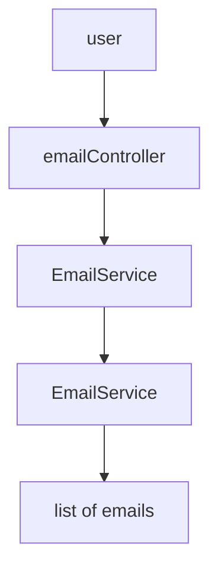
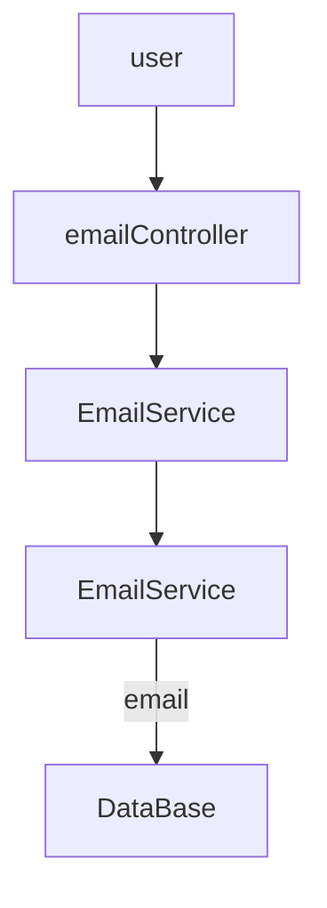

# JavaSpringTutorial

## [Class 4](https://github.com/fahimfarhan/JavaSpringTutorial/tree/class-4)
1. Go to start.spring.io, select language, version etc.
2. Add dependencies. The initial dependency is `Spring web`

The initial code is
```java
@SpringBootApplication
public class StartApplication {

  public static void main(String[] args) {
    SpringApplication.run(StartApplication.class, args);
  }
}
```

The `@SpringBootApplication` annotation is very powerful, and important. It 
has 3 components:
* `@SpringBootConfiguration`:  creates `bean` in some `container`. Bean is like lazy initialization
* `@EnableAutoConfiguration`: Auto-generates different objects. So we don't need to manually create certain objects.
* `@ComponentScan`: We're gonna use @Controller, @Service etc throughout the code. This annotation scans these all, and makes them available to the Spring framework 


## What is a `Bean`?
Suppose, 
```java
class Addition {
  int add(int i) { return 0; } // todo: logic
}
class Math {
  Addition addition = new Addition();  // <--- this object is created at the very beginning!
  
  void addNumber(int i) {
    addition.add(i); // todo: logic
  }
}
```

We don't want to create `addition` object at start time. So we use `bean`, which creates the `addition` object when we need it. 
How do we do that?

```java
@Component       // step 1: Add this line
class Addition {
  int add(int i) { return 0; } // todo: logic
}

```
This creates a bean, and stores it inside an IOC container.  Now in the class Math, you do this:

```java
import org.springframework.beans.factory.annotation.Autowired;

@Component  // <-- step 3
class Math {

  @Autowired  // <-- step 4. This connects the variable with the corresponding bean
  Addition addition;

  void addNumber(int i) {
    addition.add(i); // todo: logic
  }
}
```

3. We want to follow clean architecture. 
    user <---------> controller <-------> Services <-------> Repository <----------> DB
    Our controller class will look like this:

```java
import org.springframework.web.bind.annotation.RequestMapping;
import org.springframework.web.bind.annotation.RequestMethod;

@RestController   // <----------------- Annotates that this is a controller class. The user will first time reach here!
public class GreetController {

  @GetMapping("/greet")
    // <------------- connects an API endpoints to a method
  String greet() {
    return "Hello there!";
  }


  @RequestMapping(value = "/greet-v2", method = RequestMethod.GET)
    // <------------- connects an API endpoints to a method
  String greet() {
    return "Hello there!";
  }
}
```

4. Create a model class `Email.java`:

```java
import com.fasterxml.jackson.annotation.JsonIgnore;

class Email {
  private String title;
  private String description;
  private String someThingSecret;

  // constructor, getter, setter etc

  // if we want to ignore a field from returning to the client, use @JsonIgnore on the getter
  @JsonIgnore
  public String getSomeThingSecret() {
    return someThingSecret;
  }
}
```
5. Create an EmailService, and EmailController. Annotate them with `@Service`, and `@RestController` respectively.
6. Inside the EmailController, create an EmailService using `@AutoWired` annotation. The @Service creates an EmailService bean, that is 
   stored inside IOC (Inversion of Container). The `@AutoWired` annotation automatically links the variable with the reference of EmailService object stored in IOC.
```java
      class EmailController {
        //  @Autowired // warning dey ken? Vo.O
        //  private EmailService emailService;
      
        private EmailService emailService;
    
        @Autowired  // AutoWired using setter. Alternatively, use constructor as autocorrected by intellijIdea.
        public void setEmailService(EmailService emailService) {
          this.emailService = emailService;
        }
      }
```
7. `@PostMapping`
8. Custom exception handling: use `@ResponseStatus(HttpStatus.NOT_FOUND)`

## [Class 5](https://github.com/fahimfarhan/JavaSpringTutorial/tree/class-5)
Previously in class 4, we saw RestController, Service, and Repository.


Today, we'll add a persistence layer (database).



We'll use Spring JPA dependency. All we need to o is give JPA a model, in this case `Email`.
For simplicity, we'll use an inMemory database called `H2 database`. In the next class,
we'll see microservices, and there we'll use postgresql.