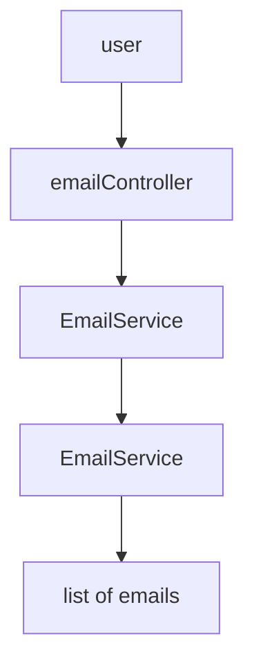
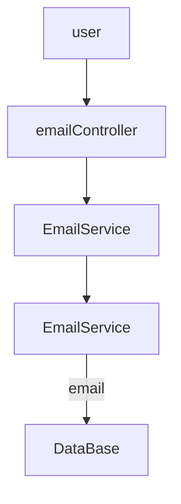
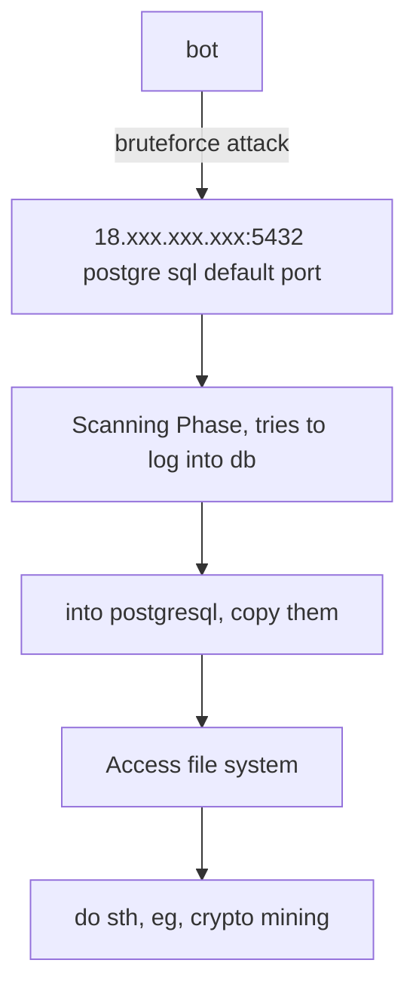

# JavaSpringTutorial

## [Class 4](https://github.com/fahimfarhan/JavaSpringTutorial/tree/class-4)
1. Go to start.spring.io, select language, version etc.
2. Add dependencies. The initial dependency is `Spring web`

The initial code is
```java
@SpringBootApplication
public class StartApplication {

  public static void main(String[] args) {
    SpringApplication.run(StartApplication.class, args);
  }
}
```

The `@SpringBootApplication` annotation is very powerful, and important. It 
has 3 components:
* `@SpringBootConfiguration`:  creates `bean` in some `container`. Bean is like lazy initialization
* `@EnableAutoConfiguration`: Auto-generates different objects. So we don't need to manually create certain objects.
* `@ComponentScan`: We're gonna use @Controller, @Service etc throughout the code. This annotation scans these all, and makes them available to the Spring framework 


## What is a `Bean`?
Suppose, 
```java
class Addition {
  int add(int i) { return 0; } // todo: logic
}
class Math {
  Addition addition = new Addition();  // <--- this object is created at the very beginning!
  
  void addNumber(int i) {
    addition.add(i); // todo: logic
  }
}
```

We don't want to create `addition` object at start time. So we use `bean`, which creates the `addition` object when we need it. 
How do we do that?

```java
@Component       // step 1: Add this line
class Addition {
  int add(int i) { return 0; } // todo: logic
}

```
This creates a bean, and stores it inside an IOC container.  Now in the class Math, you do this:

```java
import org.springframework.beans.factory.annotation.Autowired;

@Component  // <-- step 3
class Math {

  @Autowired  // <-- step 4. This connects the variable with the corresponding bean
  Addition addition;

  void addNumber(int i) {
    addition.add(i); // todo: logic
  }
}
```

3. We want to follow clean architecture. 
    user <---------> controller <-------> Services <-------> Repository <----------> DB
    Our controller class will look like this:

```java
import org.springframework.web.bind.annotation.RequestMapping;
import org.springframework.web.bind.annotation.RequestMethod;

@RestController   // <----------------- Annotates that this is a controller class. The user will first time reach here!
public class GreetController {

  @GetMapping("/greet")
    // <------------- connects an API endpoints to a method
  String greet() {
    return "Hello there!";
  }


  @RequestMapping(value = "/greet-v2", method = RequestMethod.GET)
    // <------------- connects an API endpoints to a method
  String greet() {
    return "Hello there!";
  }
}
```

4. Create a model class `Email.java`:

```java
import com.fasterxml.jackson.annotation.JsonIgnore;

class Email {
  private String title;
  private String description;
  private String someThingSecret;

  // constructor, getter, setter etc

  // if we want to ignore a field from returning to the client, use @JsonIgnore on the getter
  @JsonIgnore
  public String getSomeThingSecret() {
    return someThingSecret;
  }
}
```

5. Create an EmailService, and EmailController. Annotate them with `@Service`, and `@RestController` respectively.

6. Inside the EmailController, create an EmailService using `@AutoWired` annotation. The @Service creates an EmailService bean, that is 
   stored inside IOC (Inversion of Container). The `@AutoWired` annotation automatically links the variable with the reference of EmailService object stored in IOC.

```java
      class EmailController {
        //  @Autowired // warning dey ken? Vo.O
        //  private EmailService emailService;
      
        private EmailService emailService;
    
        @Autowired  // AutoWired using setter. Alternatively, use constructor as autocorrected by intellijIdea.
        public void setEmailService(EmailService emailService) {
          this.emailService = emailService;
        }
      }
```
7. `@PostMapping`

8. Custom exception handling: use `@ResponseStatus(HttpStatus.NOT_FOUND)`

9. In post request, Add the annotation, `@RequestBody Model model`

10. In postman, by default `text` is selected. Change it to `json`, else you'll get error.

## [Class 5](https://github.com/fahimfarhan/JavaSpringTutorial/tree/class-5)
Previously in class 4, we saw RestController, Service, and Repository.


Today, we'll add a persistence layer (database).



We'll use Spring JPA dependency. All we need to o is give JPA a model, in this case `Email`.
For simplicity, we'll use an inMemory database called `H2 database`. In the next class,
we'll see microservices, and there we'll use postgresql.

1. Add h2-db, jpa, and hibernate-core dependencies. Update: hibernamte-core is not needed. I had added a wrong JPA dependency, that's why I got error. Changing the JPA resolved the problem.

2. Create an interface called `EmailRepository`, and annotate with `@Repository`.

3. The emailRepo should extend `JpaRepository`.

4. ORM = Object relation mapping

5. Annotate the Email class with `@Entity`

6. Create a field `id` for primary key. The primary key must be annotated with `@Id`, and `@GeneratedValue`.

7. Update the emailService class by adding Autowired emailRepository object.

**Got an error. Tried to repair it, but failed! Log:**
```bash
 
  .   ____          _            __ _ _
 /\\ / ___'_ __ _ _(_)_ __  __ _ \ \ \ \
( ( )\___ | '_ | '_| | '_ \/ _` | \ \ \ \
 \\/  ___)| |_)| | | | | || (_| |  ) ) ) )
  '  |____| .__|_| |_|_| |_\__, | / / / /
 =========|_|==============|___/=/_/_/_/
 :: Spring Boot ::                (v2.7.1)

2022-07-22 12:53:57.320  INFO 27003 --- [           main] indiedev.soumic.start.StartApplication   : Starting StartApplication using Java 18.0.2 on Zephyrus-G14 with PID 27003 (/home/soumic/Codes/JavaSpringTutorial/start/build/classes/java/main started by soumic in /home/soumic/Codes/JavaSpringTutorial/start)
2022-07-22 12:53:57.322  INFO 27003 --- [           main] indiedev.soumic.start.StartApplication   : No active profile set, falling back to 1 default profile: "default"
2022-07-22 12:53:57.628  INFO 27003 --- [           main] .s.d.r.c.RepositoryConfigurationDelegate : Bootstrapping Spring Data JPA repositories in DEFAULT mode.
2022-07-22 12:53:57.653  INFO 27003 --- [           main] .s.d.r.c.RepositoryConfigurationDelegate : Finished Spring Data repository scanning in 21 ms. Found 1 JPA repository interfaces.
2022-07-22 12:53:57.926  INFO 27003 --- [           main] o.s.b.w.embedded.tomcat.TomcatWebServer  : Tomcat initialized with port(s): 8080 (http)
2022-07-22 12:53:57.932  INFO 27003 --- [           main] o.apache.catalina.core.StandardService   : Starting service [Tomcat]
2022-07-22 12:53:57.932  INFO 27003 --- [           main] org.apache.catalina.core.StandardEngine  : Starting Servlet engine: [Apache Tomcat/9.0.64]
2022-07-22 12:53:57.980  INFO 27003 --- [           main] o.a.c.c.C.[Tomcat].[localhost].[/]       : Initializing Spring embedded WebApplicationContext
2022-07-22 12:53:57.980  INFO 27003 --- [           main] w.s.c.ServletWebServerApplicationContext : Root WebApplicationContext: initialization completed in 626 ms
2022-07-22 12:53:57.991  INFO 27003 --- [           main] o.s.j.d.e.EmbeddedDatabaseFactory        : Starting embedded database: url='jdbc:h2:mem:f00b51fa-7fbf-41fa-828a-a55894cfbfd4;DB_CLOSE_DELAY=-1;DB_CLOSE_ON_EXIT=false', username='sa'
2022-07-22 12:53:58.040  INFO 27003 --- [           main] o.s.b.a.h2.H2ConsoleAutoConfiguration    : H2 console available at '/h2-console'. Database available at 'jdbc:h2:mem:f00b51fa-7fbf-41fa-828a-a55894cfbfd4'
2022-07-22 12:53:58.089  WARN 27003 --- [           main] ConfigServletWebServerApplicationContext : Exception encountered during context initialization - cancelling refresh attempt: org.springframework.beans.factory.UnsatisfiedDependencyException: Error creating bean with name 'emailController': Unsatisfied dependency expressed through method 'setEmailService' parameter 0; nested exception is org.springframework.beans.factory.UnsatisfiedDependencyException: Error creating bean with name 'emailService': Unsatisfied dependency expressed through field 'emailRepository'; nested exception is org.springframework.beans.factory.BeanCreationException: Error creating bean with name 'emailRepository' defined in indiedev.soumic.start.email.EmailRepository defined in @EnableJpaRepositories declared on JpaRepositoriesRegistrar.EnableJpaRepositoriesConfiguration: Cannot create inner bean '(inner bean)#427ae189' of type [org.springframework.orm.jpa.SharedEntityManagerCreator] while setting bean property 'entityManager'; nested exception is org.springframework.beans.factory.BeanCreationException: Error creating bean with name '(inner bean)#427ae189': Cannot resolve reference to bean 'entityManagerFactory' while setting constructor argument; nested exception is org.springframework.beans.factory.NoSuchBeanDefinitionException: No bean named 'entityManagerFactory' available
2022-07-22 12:53:58.090  INFO 27003 --- [           main] o.s.j.d.e.EmbeddedDatabaseFactory        : Shutting down embedded database: url='jdbc:h2:mem:f00b51fa-7fbf-41fa-828a-a55894cfbfd4;DB_CLOSE_DELAY=-1;DB_CLOSE_ON_EXIT=false'
2022-07-22 12:53:58.295  INFO 27003 --- [           main] o.apache.catalina.core.StandardService   : Stopping service [Tomcat]
2022-07-22 12:53:58.306  INFO 27003 --- [           main] ConditionEvaluationReportLoggingListener : 

Error starting ApplicationContext. To display the conditions report re-run your application with 'debug' enabled.
2022-07-22 12:53:58.313 ERROR 27003 --- [           main] o.s.b.d.LoggingFailureAnalysisReporter   : 

***************************
APPLICATION FAILED TO START
***************************

Description:

Field emailRepository in indiedev.soumic.start.email.EmailService required a bean named 'entityManagerFactory' that could not be found.


Action:

Consider defining a bean named 'entityManagerFactory' in your configuration.


Process finished with exit code 1
```
Question: How do I define this bean entityManagerFactory? Help needed.

8. Changing the JPA dependency repaired the error in step 7

9. Add Spring boot starter security dependency, change nothing else, and run. The get requests will give `401 unauthorized` error. In the logs, you'll find sth like this

```bash
Using generated security password: 5a31a789-2c8b-4f45-875a-b59821e3648f

This generated password is for development use only. Your security configuration must be updated before running your application in production.
```
Use that to get authorized. So in postman, select `basic auth`, then set `username = user`, and `password = 5a31a789-2c8b-4f45-875a-b59821e3648f`.
The get request should now work.

10. Open the `application.properties` file, and add

```properties
spring.security.user.name=ricardo_milos  # your user name,
spring.security.user.password=1234       # your password
```
(if we are going to save username, and password here, either this file must be in .gitignore, or use something like .env file, and read username, password from there.
I guess we're in early stage, and so we're keeping it simple.)
Now goto postman, and in our get request, change username, password to those that you set in your `application.properties`.

11. The get request will work, but the post request won't work!

12. **CSRF** = cross site request forgery


13. Spring security adds protection to `patch`, `put`, `post`, `delete` requests as they **modify the records in th db**, but NOT `get`, since we only read from db.

14. Create a class `SecurityConfig` so that we may change the default behavior of the spring config. Create `SecurityConfig.java`, and disable `csrf` for development convenience. Don't do it in production, since you'll
face malicious attacks (pg botnet attack?). 

How to prevent them? A. use strong password, B. use docker (the attacker won't get access into the main OS even if the docker is breached).

15. if post response is successful, return `ResponseEntity.status(HttpStatus.CREATED).build()`, else return badRequest.

16. Open up `EmailRepository`, and add this interface method:

```java
@Repository
public interface EmailRepository extends JpaRepository<Email, Integer> {
  /**
   Jpa knows `findBy` keyword. so we have to give the last word.In our model, we have
   title. so it will become Title
   titlle => Titlle

   Format:
   first character upperCase + the rest of the string is exactly the same. That's it!
   */
  Email findByTitle(String title);
  Email findByTitleIgnoreCase(String title);
}
```
Jpa knows `findBy` keyword. so we have to give the last word.In our model, we have
```text
title. so it will become Title
titlle => Titlle

Format:
first character upperCase + the rest of the string is exactly the same. That's it!
```

IntelliIdea autosuggestion dey, so ki ki erokom banano jabe, segulor suggestion peye jabo.


Another keyword for model:
`@NotBlank`

```java

```