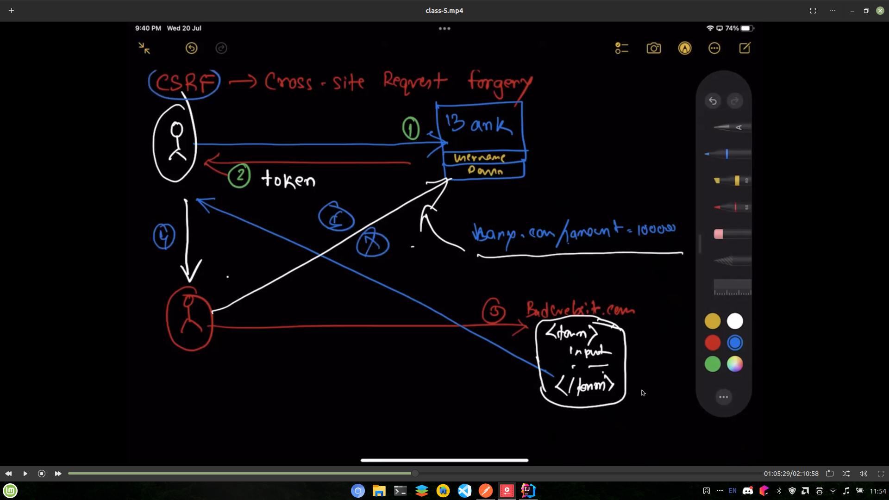

# JavaSpringTutorial

## [Class 4](https://github.com/fahimfarhan/JavaSpringTutorial/tree/class-4)
1. Go to start.spring.io, select language, version etc.
2. Add dependencies. The initial dependency is `Spring web`

The initial code is
```java
@SpringBootApplication
public class StartApplication {

  public static void main(String[] args) {
    SpringApplication.run(StartApplication.class, args);
  }
}
```

The `@SpringBootApplication` annotation is very powerful, and important. It 
has 3 components:
* `@SpringBootConfiguration`:  creates `bean` in some `container`. Bean is like lazy initialization
* `@EnableAutoConfiguration`: Auto-generates different objects. So we don't need to manually create certain objects.
* `@ComponentScan`: We're gonna use @Controller, @Service etc throughout the code. This annotation scans these all, and makes them available to the Spring framework 


## What is a `Bean`?
Suppose, 
```java
class Addition {
  int add(int i) { return 0; } // todo: logic
}
class Math {
  Addition addition = new Addition();  // <--- this object is created at the very beginning!
  
  void addNumber(int i) {
    addition.add(i); // todo: logic
  }
}
```

We don't want to create `addition` object at start time. So we use `bean`, which creates the `addition` object when we need it. 
How do we do that?

```java
@Component       // step 1: Add this line
class Addition {
  int add(int i) { return 0; } // todo: logic
}

```
This creates a bean, and stores it inside an IOC container.  Now in the class Math, you do this:

```java
import org.springframework.beans.factory.annotation.Autowired;

@Component  // <-- step 3
class Math {

  @Autowired  // <-- step 4. This connects the variable with the corresponding bean
  Addition addition;

  void addNumber(int i) {
    addition.add(i); // todo: logic
  }
}
```

3. We want to follow clean architecture. 
    user <---------> controller <-------> Services <-------> Repository <----------> DB
    Our controller class will look like this:

```java
import org.springframework.web.bind.annotation.RequestMapping;
import org.springframework.web.bind.annotation.RequestMethod;

@RestController   // <----------------- Annotates that this is a controller class. The user will first time reach here!
public class GreetController {

  @GetMapping("/greet")
    // <------------- connects an API endpoints to a method
  String greet() {
    return "Hello there!";
  }


  @RequestMapping(value = "/greet-v2", method = RequestMethod.GET)
    // <------------- connects an API endpoints to a method
  String greet() {
    return "Hello there!";
  }
}
```

4. Create a model class `Email.java`:

```java
import com.fasterxml.jackson.annotation.JsonIgnore;

class Email {
  private String title;
  private String description;
  private String someThingSecret;

  // constructor, getter, setter etc

  // if we want to ignore a field from returning to the client, use @JsonIgnore on the getter
  @JsonIgnore
  public String getSomeThingSecret() {
    return someThingSecret;
  }
}
```

5. Create an EmailService, and EmailController. Annotate them with `@Service`, and `@RestController` respectively.

6. Inside the EmailController, create an EmailService using `@AutoWired` annotation. The @Service creates an EmailService bean, that is 
   stored inside IOC (Inversion of Container). The `@AutoWired` annotation automatically links the variable with the reference of EmailService object stored in IOC.

```java
      class EmailController {
        //  @Autowired // warning dey ken? Vo.O
        //  private EmailService emailService;
      
        private EmailService emailService;
    
        @Autowired  // AutoWired using setter. Alternatively, use constructor as autocorrected by intellijIdea.
        public void setEmailService(EmailService emailService) {
          this.emailService = emailService;
        }
      }
```
7. `@PostMapping`

8. Custom exception handling: use `@ResponseStatus(HttpStatus.NOT_FOUND)`

9. In post request, Add the annotation, `@RequestBody Model model`

10. In postman, by default `text` is selected. Change it to `json`, else you'll get error.

## [Class 5](https://github.com/fahimfarhan/JavaSpringTutorial/tree/class-5)
Previously in class 4, we saw RestController, Service, and Repository.


Today, we'll add a persistence layer (database).


We'll use Spring JPA dependency. All we need to o is give JPA a model, in this case `Email`.
For simplicity, we'll use an inMemory database called `H2 database`. In the next class,
we'll see microservices, and there we'll use postgresql.

1. Add h2-db, jpa, and hibernate-core dependencies. Update: hibernamte-core is not needed. I had added a wrong JPA dependency, that's why I got error. Changing the JPA resolved the problem.

2. Create an interface called `EmailRepository`, and annotate with `@Repository`.

3. The emailRepo should extend `JpaRepository`.

4. ORM = Object relation mapping

5. Annotate the Email class with `@Entity`

6. Create a field `id` for primary key. The primary key must be annotated with `@Id`, and `@GeneratedValue`.

7. Update the emailService class by adding Autowired emailRepository object.

**Got an error. Tried to repair it, but failed! Log:**
```bash
 
  .   ____          _            __ _ _
 /\\ / ___'_ __ _ _(_)_ __  __ _ \ \ \ \
( ( )\___ | '_ | '_| | '_ \/ _` | \ \ \ \
 \\/  ___)| |_)| | | | | || (_| |  ) ) ) )
  '  |____| .__|_| |_|_| |_\__, | / / / /
 =========|_|==============|___/=/_/_/_/
 :: Spring Boot ::                (v2.7.1)

2022-07-22 12:53:57.320  INFO 27003 --- [           main] indiedev.soumic.start.StartApplication   : Starting StartApplication using Java 18.0.2 on Zephyrus-G14 with PID 27003 (/home/soumic/Codes/JavaSpringTutorial/start/build/classes/java/main started by soumic in /home/soumic/Codes/JavaSpringTutorial/start)
2022-07-22 12:53:57.322  INFO 27003 --- [           main] indiedev.soumic.start.StartApplication   : No active profile set, falling back to 1 default profile: "default"
2022-07-22 12:53:57.628  INFO 27003 --- [           main] .s.d.r.c.RepositoryConfigurationDelegate : Bootstrapping Spring Data JPA repositories in DEFAULT mode.
2022-07-22 12:53:57.653  INFO 27003 --- [           main] .s.d.r.c.RepositoryConfigurationDelegate : Finished Spring Data repository scanning in 21 ms. Found 1 JPA repository interfaces.
2022-07-22 12:53:57.926  INFO 27003 --- [           main] o.s.b.w.embedded.tomcat.TomcatWebServer  : Tomcat initialized with port(s): 8080 (http)
2022-07-22 12:53:57.932  INFO 27003 --- [           main] o.apache.catalina.core.StandardService   : Starting service [Tomcat]
2022-07-22 12:53:57.932  INFO 27003 --- [           main] org.apache.catalina.core.StandardEngine  : Starting Servlet engine: [Apache Tomcat/9.0.64]
2022-07-22 12:53:57.980  INFO 27003 --- [           main] o.a.c.c.C.[Tomcat].[localhost].[/]       : Initializing Spring embedded WebApplicationContext
2022-07-22 12:53:57.980  INFO 27003 --- [           main] w.s.c.ServletWebServerApplicationContext : Root WebApplicationContext: initialization completed in 626 ms
2022-07-22 12:53:57.991  INFO 27003 --- [           main] o.s.j.d.e.EmbeddedDatabaseFactory        : Starting embedded database: url='jdbc:h2:mem:f00b51fa-7fbf-41fa-828a-a55894cfbfd4;DB_CLOSE_DELAY=-1;DB_CLOSE_ON_EXIT=false', username='sa'
2022-07-22 12:53:58.040  INFO 27003 --- [           main] o.s.b.a.h2.H2ConsoleAutoConfiguration    : H2 console available at '/h2-console'. Database available at 'jdbc:h2:mem:f00b51fa-7fbf-41fa-828a-a55894cfbfd4'
2022-07-22 12:53:58.089  WARN 27003 --- [           main] ConfigServletWebServerApplicationContext : Exception encountered during context initialization - cancelling refresh attempt: org.springframework.beans.factory.UnsatisfiedDependencyException: Error creating bean with name 'emailController': Unsatisfied dependency expressed through method 'setEmailService' parameter 0; nested exception is org.springframework.beans.factory.UnsatisfiedDependencyException: Error creating bean with name 'emailService': Unsatisfied dependency expressed through field 'emailRepository'; nested exception is org.springframework.beans.factory.BeanCreationException: Error creating bean with name 'emailRepository' defined in indiedev.soumic.start.email.EmailRepository defined in @EnableJpaRepositories declared on JpaRepositoriesRegistrar.EnableJpaRepositoriesConfiguration: Cannot create inner bean '(inner bean)#427ae189' of type [org.springframework.orm.jpa.SharedEntityManagerCreator] while setting bean property 'entityManager'; nested exception is org.springframework.beans.factory.BeanCreationException: Error creating bean with name '(inner bean)#427ae189': Cannot resolve reference to bean 'entityManagerFactory' while setting constructor argument; nested exception is org.springframework.beans.factory.NoSuchBeanDefinitionException: No bean named 'entityManagerFactory' available
2022-07-22 12:53:58.090  INFO 27003 --- [           main] o.s.j.d.e.EmbeddedDatabaseFactory        : Shutting down embedded database: url='jdbc:h2:mem:f00b51fa-7fbf-41fa-828a-a55894cfbfd4;DB_CLOSE_DELAY=-1;DB_CLOSE_ON_EXIT=false'
2022-07-22 12:53:58.295  INFO 27003 --- [           main] o.apache.catalina.core.StandardService   : Stopping service [Tomcat]
2022-07-22 12:53:58.306  INFO 27003 --- [           main] ConditionEvaluationReportLoggingListener : 

Error starting ApplicationContext. To display the conditions report re-run your application with 'debug' enabled.
2022-07-22 12:53:58.313 ERROR 27003 --- [           main] o.s.b.d.LoggingFailureAnalysisReporter   : 

***************************
APPLICATION FAILED TO START
***************************

Description:

Field emailRepository in indiedev.soumic.start.email.EmailService required a bean named 'entityManagerFactory' that could not be found.


Action:

Consider defining a bean named 'entityManagerFactory' in your configuration.


Process finished with exit code 1
```
Question: How do I define this bean entityManagerFactory? Help needed.

8. Changing the JPA dependency repaired the error in step 7

9. Add Spring boot starter security dependency, change nothing else, and run. The get requests will give `401 unauthorized` error. In the logs, you'll find sth like this

```bash
Using generated security password: 5a31a789-2c8b-4f45-875a-b59821e3648f

This generated password is for development use only. Your security configuration must be updated before running your application in production.
```
Use that to get authorized. So in postman, select `basic auth`, then set `username = user`, and `password = 5a31a789-2c8b-4f45-875a-b59821e3648f`.
The get request should now work.

10. Open the `application.properties` file, and add

```properties
spring.security.user.name=ricardo_milos  # your user name,
spring.security.user.password=1234       # your password
```
(if we are going to save username, and password here, either this file must be in .gitignore, or use something like .env file, and read username, password from there.
I guess we're in early stage, and so we're keeping it simple.)
Now goto postman, and in our get request, change username, password to those that you set in your `application.properties`.

11. The get request will work, but the post request won't work!

12. **CSRF** = cross site request forgery



13. Spring security adds protection to `patch`, `put`, `post`, `delete` requests as they **modify the records in th db**, but NOT `get`, since we only read from db.

14. Create a class `SecurityConfig` so that we may change the default behavior of the spring config. Create `SecurityConfig.java`, and disable `csrf` for development convenience. Don't do it in production, since you'll
face malicious attacks (pg botnet attack?). 

How to prevent them? A. use strong password, B. use docker (the attacker won't get access into the main OS even if the docker is breached).

15. if post response is successful, return `ResponseEntity.status(HttpStatus.CREATED).build()`, else return badRequest.

16. Open up `EmailRepository`, and add this interface method:

```java
@Repository
public interface EmailRepository extends JpaRepository<Email, Integer> {
  /**
   Jpa knows `findBy` keyword. so we have to give the last word.In our model, we have
   title. so it will become Title
   titlle => Titlle

   Format:
   first character upperCase + the rest of the string is exactly the same. That's it!
   */
  Email findByTitle(String title);
  Email findByTitleIgnoreCase(String title);
}
```
Jpa knows `findBy` keyword. so we have to give the last word.In our model, we have
```text
title. so it will become Title
titlle => Titlle

Format:
first character upperCase + the rest of the string is exactly the same. That's it!
```

IntelliIdea autosuggestion dey, so ki ki erokom banano jabe, segulor suggestion peye jabo.


Another keyword for model:
`@NotBlank`

```java

```

## [Class 6](https://github.com/fahimfarhan/JavaSpringTutorial/tree/class-6)

Today we'll work with micro-services. In the previous class, we built only one service (EmailService). If we want to 
make, say, an ecommerce website, there will be a myriad kinds of services. Only a small service maybe an emailService.
The instructor worked on an emailService in his company that sends customers an auto-generated email every month.

When we build a monolithic application, there will be a lot of services. But a microservice has a lot of services. So
what's the difference :monocle_face: ?

Let's juxtapose the 2 to see their differences.

```text
   ---------------------------
   |    inventory            |  <--- Everything in one server. So only one ip for everything.
   |                         |       this is 127.0.0.1:8080, everything is seperated with /inventory, /store, /shipping...
   |    store                |       this  is the problem. Suppose it is black friday. There will be a lot of sale. 
   |                         |
   |    Shipping             |
   ---------------------------
     Monolithic architecture
```
Teletalk ssc, hsc exam service goes down. say no more...

On black friday, there will be a lot of hits on the `/shipping`. Since we want to scale up, the entire thing gets scaled.
So we have unused `/inventory`, and `/store` services running.

```text
   ---------------------------
   |        inventory        |  scale up. After rush hour, scale down...
   ---------------------------
   
   ------------
   |   store  |   scale down. During rush hour, scale up...
   ------------
   
   ---------------------------
   |    Shipping             |  scale up. After rush hour, scale down...
   ---------------------------

    Microservice architecture
```

What is the main advantage of using microservice architecture?

If one is down, the rest of the services won't be affected. If `inventory` is down, the `store` and `shipping` are 
working. In monolithic, everything is down if the server is down.


The instructor is using maven cli to generate a new project. I'll be using gradle.

* Random question by a course-mate: Which language is better for microservice architecture? *

Answer: Language doesn't matter. Every language has some similarities. Such as OOP is similar in c++, java, c#. If you
know one, you can do it in any language.

Now for microservice, different frameworks exists in different language. Python-djando, java-spring, ...

The important question is, `What are we building?`

If we are building very complex / enterprise level software, most of the time we select java. Netflix, Amazon have a lot
of their services built with java.

But if you want to build sth in short notice, then perhaps nodejs is better.

Everything has its pros and cons. So language doesn't matter, but the project matters. What we are building, what is the
service, what the design should be , matters.

So, I created a project in gradle (because android..., and here I diverge from the video), and now I need to add some
dependencies.

In mvn, one needs to add a plugin management. Not sure if we need that in gradle.

## Dependencies
* Add spring boot
```kotlin
plugins {
  // Apply the application plugin to add support for building a CLI application in Java.
  application
  java
  id("org.springframework.boot") version "2.7.5"
  id("io.spring.dependency-management") version "1.0.11.RELEASE"

}
```
* there will be 2 dependency blocks: parent, and child. Since we're building microservices, there will be a lot of 
  common dependencies. We'll add those in the parent block. And the child specific dependencies will go inside the child's
  block.
* Looks like I'm gonna need to google a few things for gradle. Alternatively, I'll just open android studio project, and
  copy the top level gradle. Here's a [github gist link(kotlin)](https://github.com/gradle/kotlin-dsl-samples/blob/master/samples/hello-android/build.gradle.kts)
  or [github gist link(gradle)](https://gist.github.com/SeanZoR/af0932faea7d74e3a98e) to help you get started.
* Since I'll be using spring-boot everywhere, it should go inside the top level gradle.

(Change of plan, stick to the video, and use maven. Later when I'll understand everything properly, I'll use gradle).

Create maven project `my-app`, using the command:
```bash
mvn -B archetype:generate -DgroupId=com.mycompany.app -DartifactId=my-app -DarchetypeArtifactId=maven-archetype-quickstart -DarchetypeVersion=1.4
```
Then we'll be configuring our `pom.xml`. Initially,
```xml

<properties>
    <project.build.sourceEncoding>UTF-8</project.build.sourceEncoding>
    <maven.compiler.source>1.7</maven.compiler.source>
    <maven.compiler.target>1.7</maven.compiler.target>
</properties>

<dependencies>
<!-- video te junit silo na, amartay ase...-->
<dependency>
    <groupId>junit</groupId>
    <artifactId>junit</artifactId>
    <version>4.11</version>
    <scope>test</scope>
</dependency>
</dependencies>
```

Add spring-boot dependencies in the `properties`.
```xml

<properties>
<!-- initial dependencies... -->
    <spring.boot.maven.plugin.version>2.7.1</spring.boot.maven.plugin.version>
    <spring.boot.dependencies.version>2.7.1</spring.boot.dependencies.version>
</properties>
```

We'll be building microservices. We'll have lots of services under `my-app`. My app is like `Daraz`(an ecommerce site),
and under it, we'll have `email service`, `inventory service`, `storage service` etc under the `my-app`. Create 
`<dependencyManagement><dependencies>` and add common dependencies. The children services will directly inherit common dependencies
from `<dependencyManagement><dependencies>`.

```xml
<dependencyManagement>
    <dependencies>
        <!-- https://mvnrepository.com/artifact/org.springframework.boot/spring-boot-starter-web -->
        <dependency>
            <groupId>org.springframework.boot</groupId>
            <artifactId>spring-boot-dependencies</artifactId>
            <version>${spring.boot.dependencies.version}</version>
            <scope>import</scope>
            <type>pom</type>
        </dependency>

    </dependencies>
</dependencyManagement>
```

And in the normal dependency block, add `lombok` to auto-generate the getter and setter. Now we're good to go!

[https://spring.io/microservices](https://spring.io/microservices) is a nice guide to get started. 

An important dependency for spring microservice is `spring-cloud` (just keep in mind, we'll use it later).

## So what are we gonna make?

a demo bank. my-app will be a demo-bank, we'll have some customers, a service will check whether the customer is valid
or not. We'll also have an email service, and notification service.

### Create new module named `Client`

This is our first microservice.
in the `pom.xml(Client)`, add dependency:

```xml

<dependencies>
    <!-- https://mvnrepository.com/artifact/org.springframework.boot/spring-boot-starter-web -->
    <dependency>
        <groupId>org.springframework.boot</groupId>
        <artifactId>spring-boot-starter-web</artifactId>
        <version>2.7.1</version>
    </dependency>
</dependencies>
```

After that, the instructor created a new package. (The instructor had only `client/src/main/java`, whereas I have 
`client/src/main/java/com/mycompany/app`, guess I'm gonna delete that folder, and follow the instructor precisely).

Delete com.mycompany.app/Main.java (In case anything goes wrong, recreate it manually. it's simply prints a hello world in psvm).
Now create package `com.soumic.client`. Create `ClientApplication` class. Annotate it with `@SpringBootApplication`, and 
add a `psvm`, and add:
```java
@SpringBootApplication
public class ClientApplication {
  public static void main(String[] args) {
    SpringApplication.run(ClientApplication.class, args);
  }
}
```
Next we'll be developing our business logics.
Important note: we'll be running this on different servers, and different ports.

Since we'll be using localHost, we'll run services on different ports.

Create an `application.yml` file under `resources` directory. Yml is kinda like python. so indentation is very important.
in your `resources/application.yml` file, add:

```yml
server:
  port: 8080
```

* Onto the business logic. Let's create a model named `Client`, and annotate with @Data, @Builder to autogenerate constructor,
getter, setter etc using lombok.

* Create a ClientController class.
```java
@Slf4j  // for logging
@RestController  // rest
@RequestMapping("api/v1/clients")  // starts with this url pattern
public class ClientController { }
```

We may also use `record` instead of `class` as it has some benifits.
```java
@Slf4j  // for logging
@RestController  // rest
@RequestMapping("api/v1/clients")  // starts with this url pattern
public record ClientController(ClientService clientService) {
  public void registerClient() {}
}
```

Also create a class named `ClientService`.
After that create a record `ClientServiceRequest`.

Now we want to save data, hence comes db. We'll be seeing some docker (docker compose) stuffs soon!

59:30 sec to be continued...

## Docker Basics
* Image: is nothing but source code.
* Container: When we run an image(ie, src code), we call it a container. An instance of the image is a container.
Go to docker website  https://hub.docker.com
* Need to install docker-desktop
* Suppose I installed postgres db via docker. then in my laptop, a container of postgres will be created, and my code
will communicate with that container
* Docker is kinda vm
  
  
* docker desktop is better for beginners. you can even run kubernetes inside the docker desktop.
```bash
$ sudo docker pull hello-world
Using default tag: latest  # use latest, or specific tag
latest: Pulling from library/hello-world
Digest: sha256:e18f0a777xxxx-xxxx-xxxx671ab3ec3eed05414477c951ab1a6f352a06974245fe7  # unique identifier
Status: Image is up to date for hello-world:latest
docker.io/library/hello-world:latest

$ docker run hello-world
```

## Useful commands:
```bash
$ docker ps  # shows running containers...
(base) soumic@Zephyrus-G14:~/Codes/JavaSpringTutorial$ sudo docker ps
[sudo] password for soumic:       
CONTAINER ID   IMAGE     COMMAND   CREATED   STATUS    PORTS     NAMES
(base) soumic@Zephyrus-G14:~/Codes/JavaSpringTutorial$
```

`$ docker ps -a` will show both running, and non-running containers.

Since docker is using my computer resources, I need to always monitor which containers are running, or I need.
Each container has an unique id. Use it to stop a container.

```bash
$ docker container rm <CONTAINER_ID>
# for example,
$ docker container rm 1234efrgrb45
```

The process that controls these commands is called `docker-daemon`.

## Docker compose
is a yml file. We can specify which docker containers I want, how many images I want, etc. Say I need Redis, Apache 
kafka, and postgres, I can specify them in the compose file. We also need to configure some networking.
```

dockerCompose |--> docker file --> postgres container  --->|--------------------| 
              |                                            | a single service   |
              |--> docker file --> pgAdmin container ------->|--------------------|
```

Under `my-app` create a `docker-compose.yml` file.


 
We can find these commands online :/

Now if we want to use this docker-compose.yml, then:
```bash
$ cd /path/to/my-app
$ls
Client  docker-compose.yml  pom.xml  src
$ docker compose up -d # -d for detached mode, ie, we won't see anything on the terminal... 
service "pgadmin" refers to undefined volume pgadmin: invalid compose project # I got this stupid error -_-
```
To see containers, we need to use 
```bash
$ docker compose ps  # NOT docker ps
```

I can't proceed forward without repairing this error...
1:29:40 to be continued...